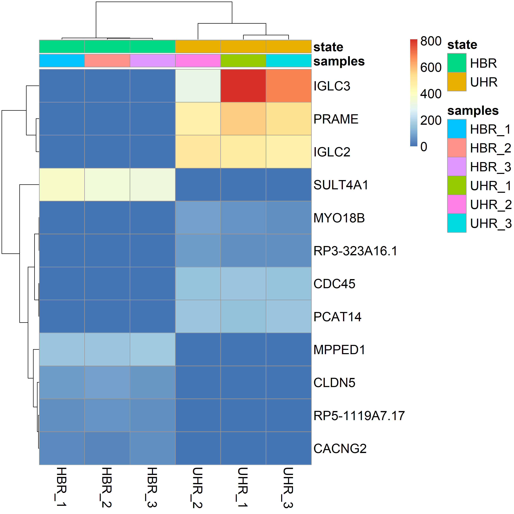
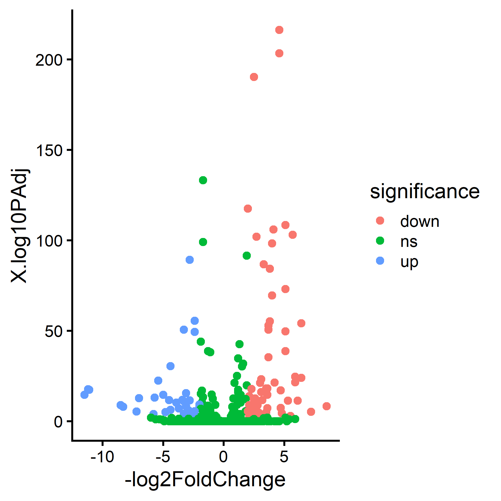
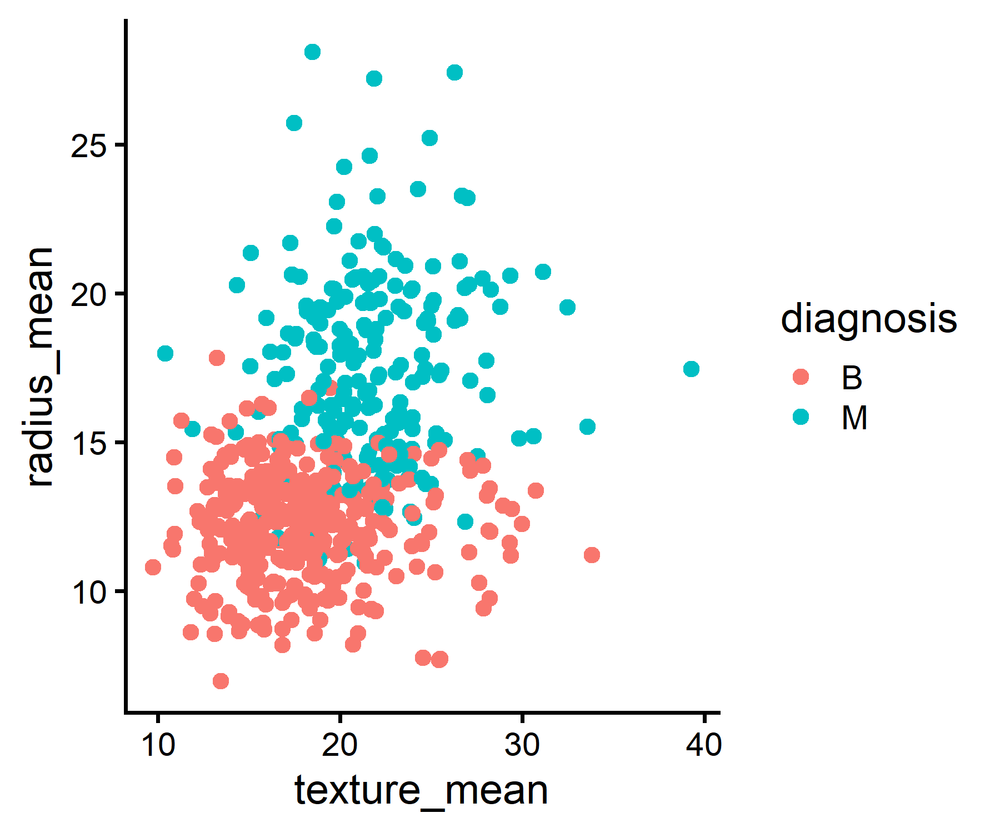
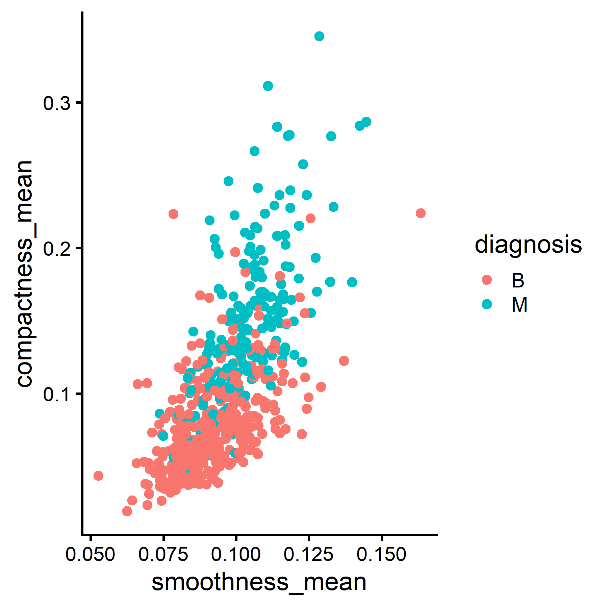
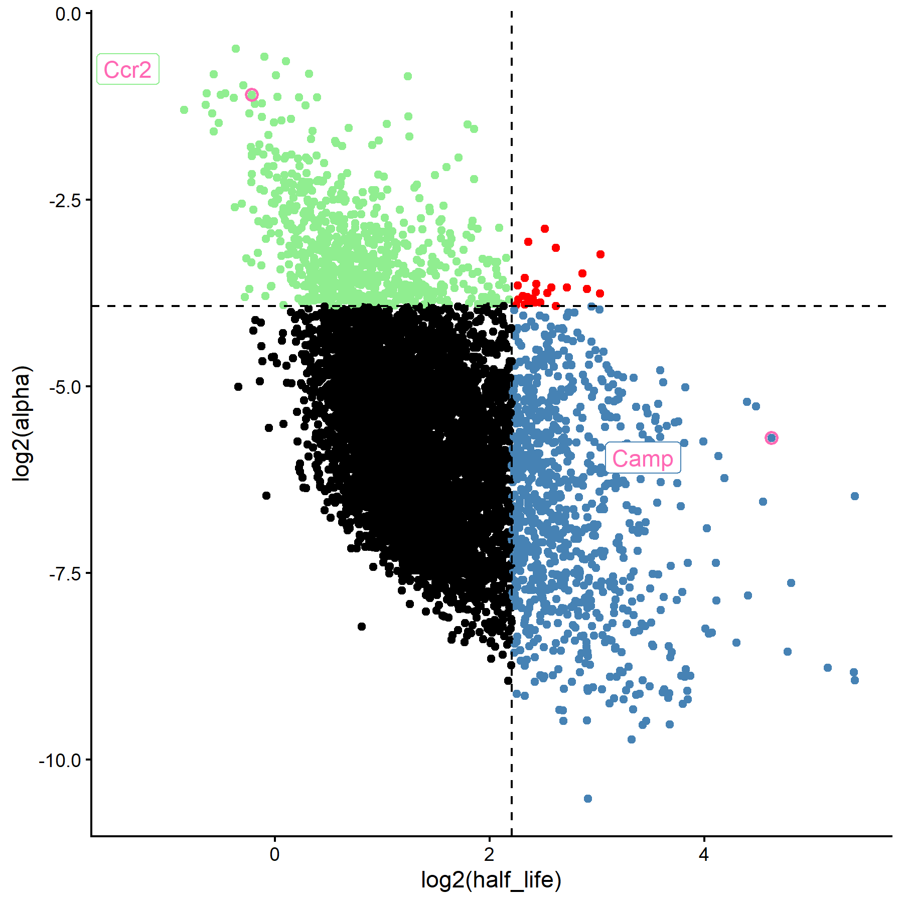
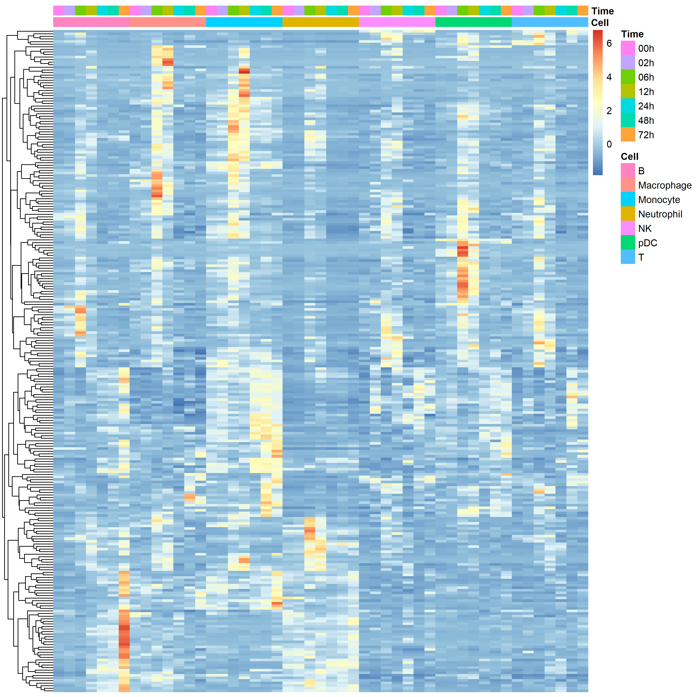
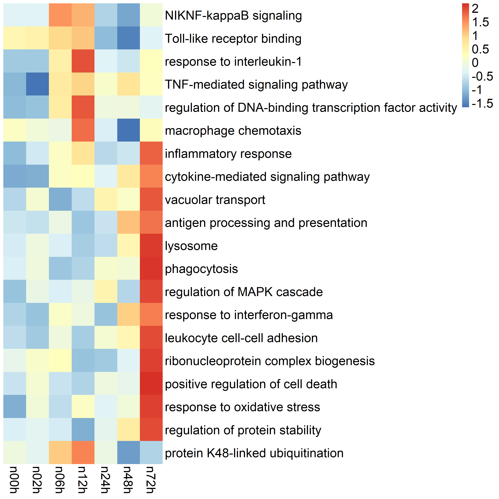
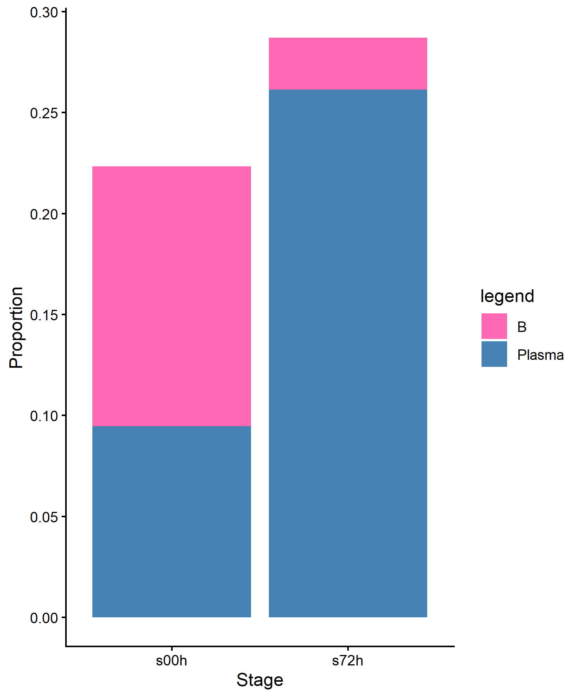
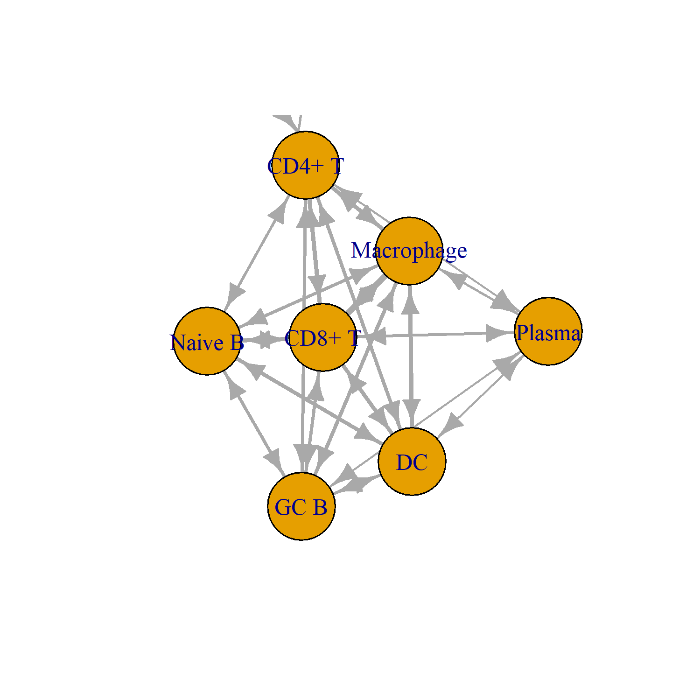

# HackBIo_internship
# stage 1 assay 

## Steps in creating calculate_protien_weight_kDa function
The first step in calculating the total weight of protein is the naming format. 
To solve this issue, I created an `if/else` statement to handle One_letter_code and Three_letter_code naming formats separately. 
The second step is using a `for loop` to automate adding up the weight of each amino acid in the protein name
to a variable called `protein_wt`.
last step is unit transformation to KDa.

# stage 2 tutorial
## Part One
### Heatmap of top differentially expressed genes between HBR and UHR 

### Vln plot of gene expression 

## Part Two
### Scatter plot of breast cancer tissue radius vs. texture

### Correlation heatmap

### Scatter plot of breast tissue smoothness vs. compactness 

### Density plot of area means for both diagnosis

## Part Three
### Cell-type ratio distributions

### Half-life vs alpha-life scatter

### Heatmap across cell types and time
Clustering genes across time in each sample. 

### Pathway enrichment heatmap

### Bubble plot of kinetic regimes

### Stacked proportions

### Directed cell–cell interaction network

The edge width describes the intensity of relationships between teo nodes. 

